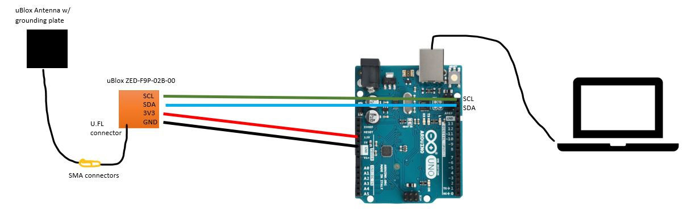

# ubloxGPS
This repo is a testing ground for building a system that logs data from a ubloxGPS receiver.

The approximate links in the chain are as follows:
1. ubloxGPS antenna connects to ublox ZED-F9P PCB via SMA-U.FL connector
2. ublox PCD connects via I2C serial to Arduino (later this is replaced by Jetson?)
3. Arduino uses the pre-made ublox-sparkfun-GNSS toolbox/functions to parse the data
4. Arduino connects to Jetson via USB to the Jetson
5. python script on the Jetson logs the GPS data

## Useful Links
Arduino I2C serial comm pins https://docs.arduino.cc/learn/communication/wire  
I2C serial basics https://www.youtube.com/watch?v=6IAkYpmA1DQ  
Note: SDA = serial data, SCL = serial clock  

## GPS module ZED-F9P-02B-00
The GPS module is from ublox and can be connected via:
1. USB-C cable to a computer. this allows you to use uBlox's[uCenter2 software](https://www.u-blox.com/en/u-center-2)
2. or via serial pins (as shown below) over I2C to an arduino. this allows you to live parse data using the [GPS Arduino Library](https://github.com/sparkfun/SparkFun_u-blox_GNSS_v3) and then log it using a python script

## Basic Test Scripts (no GPS or wiring)
#### serial_console_test.ino
This is a basic arduino script that requires no wiring (except for connecting the arduino via USB to computer). Simply pushing that file to the arduino causes the arduino to send fake data over the serial connection (from the USB), which can be viewed by the serial monitor in the arduino IDE.

To run:
1. push the code to the arduino using the arduino IDE
2. open the serial monitor (be sure the adjust the baud rate / comm port to match what the .ino specifies)

#### serial_python_test.ino with serial_python_test.py
This script also does not require any wiring (except for USB connection) and instead of the arduino IDE serial monitor to view the data being transmitted, a python script is used to read the data of the serial USB connection and logs it into a .csv.

To run:
1. push the code to the arduino using the arduino IDE
2. run the python script (be sure the adjust the baud rate / comm port to match what the .ino specifies)
 - (if WIN command prompt --> navigate to the location of the script, then type the name of the script and hit 'enter')
3. ctrl+c to stop the python logging script

## Getting GPS Data Live (w/ GPS and wiring)
### Example1_GetPositionAccuracy.ino with Example1_GetPositionAccuracy.py
This .ino script is from the pre-built ublox arduino library. Setup is necessary -- see wiring diagram below. We have to use I2C serial comms. Connect jumper cables from the uBlox ZED-F9P (I2C contacts: GND, 3V3, SDA, SCL). The 3.3V will power the module and the SCL is a clock to time the data sent from SDA. 

To run:  
0. setup the above wiring
1. push the code to the arduino using the arduino IDE
2. run the python script (be sure the adjust the baud rate / comm port  to match what the .ino specifies)
 - (if WIN command prompt --> navigate to the location of the script, then type the name of the script and hit 'enter')
3. ctrl+c to stop the python logging script

Note you are actually using a GPS now, so you may need a proper GPS signal (i.e. outdoors will be better).

### IRES_GPSlogger.ino with IRES_GPSlogger.py
Do not run this until you have successfully run the Example1_GetPositionAccuracy.ino/.py. That is the 'out of the box' pre-fab code that works and should be your starting point to get the system setup and logging. We wrote the .py file but the .ino came straight from uBlox.

These scripts are a modified version of the Example1_GetPosition Accuracy scripts to achieve our preferred data flow and processing approach. 

To run:  
0. setup the above wiring from the Example1
1. push the code to the arduino
2. run the python script
3. ctrl+c to stop logging

The outputted .csv file has the following columns:
- time elapsed (in arduino time since start of the program, in milliseconds)
- latitude (in degrees * 10^7)
- longitude (in degrees * 10^7)
- altitude (in millimeters)
- accuracy (in millimeters, not really sure how they're calculating this)

The name of the csv file contains the date and time when it was created, so you can combine this time with the arduino elapsed time to get time stamps.

